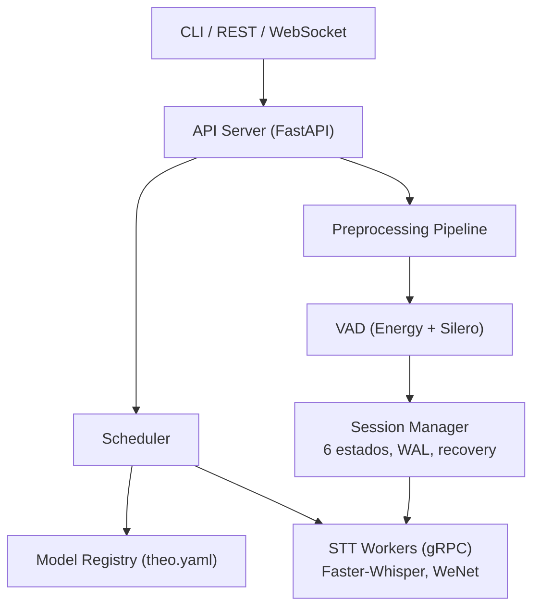

# Theo OpenVoice

Runtime unificado de voz (STT + TTS) com API compativel com OpenAI, construido do zero com bibliotecas maduras de inferencia como componentes substituiveis.

## Status

**Fase 2 completa (M1-M7).** Runtime STT model-agnostic com streaming em tempo real, session management, VAD, recovery de falhas e dois backends (Faster-Whisper + WeNet). 1217 testes, mypy strict, ruff limpo.

| Milestone | Descricao | Status |
|---|---|---|
| M1 | Fundacao (tipos, interfaces, CI) | Completo |
| M2 | Worker gRPC + Faster-Whisper | Completo |
| M3 | API Batch REST + CLI | Completo |
| M4 | Pipelines (preprocessing + ITN) | Completo |
| M5 | WebSocket + VAD (Silero + energy) | Completo |
| M6 | Session Manager (6 estados, WAL, recovery) | Completo |
| M7 | Segundo Backend (WeNet CTC) | Completo |
| M8 | Scheduler Avancado | Proximo |

O PRD completo (v2.1) esta disponivel em [`docs/PRD.md`](docs/PRD.md).

## API OpenAI-Compatible

| Endpoint | Metodo | Status | Descricao |
|---|---|---|---|
| `/v1/audio/transcriptions` | POST | Implementado | Transcricao de arquivo (batch) |
| `/v1/audio/translations` | POST | Implementado | Traducao para ingles (batch) |
| `/v1/realtime` | WebSocket | Implementado | Streaming STT bidirecional |
| `/health` | GET | Implementado | Health check |

Formatos de resposta suportados: `json`, `verbose_json`, `text`, `srt`, `vtt`.

## Quick Start

```bash
# Setup (requer Python 3.11+ e uv)
uv venv --python 3.12
uv sync --all-extras

# Iniciar runtime
theo serve

# Transcrever arquivo
curl -X POST http://localhost:8000/v1/audio/transcriptions \
  -F file=@audio.wav \
  -F model=faster-whisper-large-v3

# Ou via CLI
theo transcribe audio.wav --model faster-whisper-large-v3

# Streaming via WebSocket
wscat -c ws://localhost:8000/v1/realtime?model=faster-whisper-large-v3
```

## Instalacao

Requer Python 3.11+ e [uv](https://docs.astral.sh/uv/).

```bash
# Criar venv com Python 3.12
uv venv --python 3.12

# Instalar com todos os extras
uv sync --all-extras

# Ou extras especificos
uv sync --extra dev --extra grpc --extra server
```

> **Importante:** O projeto usa `uv` para gerenciar o venv com Python 3.12.
> Nao use `pip install` diretamente. Use `make` targets ou prefixe com `.venv/bin/`.

## Desenvolvimento

```bash
make check       # format + lint + typecheck
make test        # todos os testes (1217)
make test-unit   # apenas testes unitarios (preferido durante dev)
make test-fast   # testes exceto @pytest.mark.slow
make ci          # pipeline completo: format + lint + typecheck + test
make proto       # gerar stubs protobuf
```

Teste individual:

```bash
.venv/bin/python -m pytest tests/unit/test_foo.py::test_bar -q
```

Demos executaveis por milestone:

```bash
./scripts/demo_m4.sh   # Demo Fase 1: preprocessing + ITN + API
./scripts/demo_m6.sh   # Demo M6: session manager + recovery
./scripts/demo_m7.sh   # Demo M7: model-agnostic (WeNet + Whisper)
```

## Visao

Um unico binario que orquestra engines de inferencia (Faster-Whisper, WeNet, Silero VAD, Kokoro, Piper) com:

- **API compativel com OpenAI** para STT batch e streaming
- **Model-agnostic**: mesma interface para encoder-decoder (Whisper) e CTC (WeNet)
- **Session Manager** com 6 estados, ring buffer, WAL e recovery de falhas
- **VAD no runtime**: Silero VAD + energy pre-filter, sensitivity levels
- **Audio Preprocessing**: resample, DC remove, gain normalize
- **Post-Processing**: ITN via NeMo (fail-open)
- **CLI unificado**: `theo serve`, `theo transcribe`, `theo list`
- **Streaming real** via WebSocket com partial/final transcripts
- **Extensivel**: consumidores podem integrar qualquer transporte (RTP, SIP) via WebSocket

## Arquitetura

```
src/theo/
├── server/           # FastAPI — endpoints REST + WebSocket
│   └── routes/       # transcriptions, translations, health, realtime
├── scheduler/        # Request routing e streaming gRPC
├── registry/         # Model Registry (theo.yaml, lifecycle)
├── workers/          # Subprocess gRPC management
│   └── stt/          # STTBackend: FasterWhisperBackend + WeNetBackend
├── preprocessing/    # Audio pipeline (resample, DC remove, gain normalize)
├── postprocessing/   # Text pipeline (ITN via NeMo, fail-open)
├── vad/              # VAD (energy pre-filter + Silero)
├── session/          # Session Manager (state machine, ring buffer, WAL,
│                     #   local agreement, cross-segment, recovery, metrics)
├── cli/              # CLI commands (click)
└── proto/            # gRPC protobuf definitions
```



Detalhes completos em [`docs/ARCHITECTURE.md`](docs/ARCHITECTURE.md).

## Engines STT Suportadas

| Engine | Arquitetura | Partials | Hot Words | Status |
|---|---|---|---|---|
| Faster-Whisper | encoder-decoder | LocalAgreement | via initial_prompt | Implementado |
| WeNet | CTC | nativos | keyword boosting nativo | Implementado |

Para adicionar uma nova engine: [`docs/ADDING_ENGINE.md`](docs/ADDING_ENGINE.md) (5 passos).

## Roadmap

- **Fase 1** — STT Batch + Preprocessing (M1-M4) — **Completa**
- **Fase 2** — Streaming + Session Manager + Multi-Engine (M5-M7) — **Completa**
- **Fase 3** — Escala + Full-Duplex (M8-M9) — Proximo

Detalhes completos no [Roadmap](docs/ROADMAP.md).

## Inspiracoes

- **Ollama** — UX de CLI e modelo de registry local
- **Speaches** — Validacao de API compativel com OpenAI para STT
- **whisper-streaming** — Conceito de LocalAgreement para partial transcripts

## Licenca

[MIT](LICENSE)
