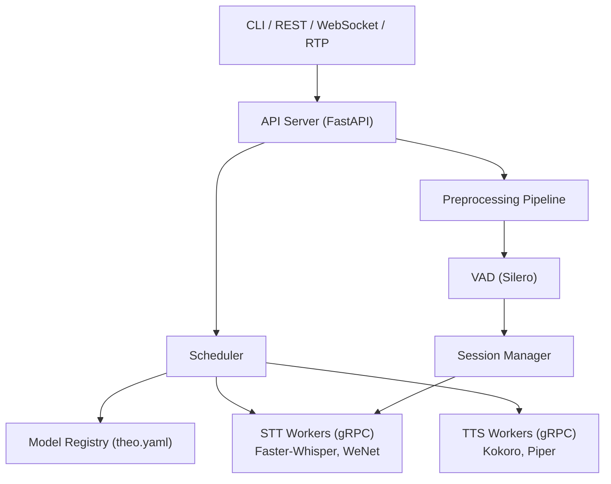

# Theo OpenVoice

Runtime unificado de voz (STT + TTS) com API compativel com OpenAI, construido do zero com bibliotecas maduras de inferencia como componentes substituiveis.

## Status

**M1 (Fundacao) completo.** Tipos, interfaces, configs, exceptions, protobuf e testes unitarios implementados.
M2 (gRPC Worker + Faster-Whisper) em andamento.

O PRD completo (v2.1) esta disponivel em [`docs/PRD.md`](docs/PRD.md).

## API OpenAI-Compatible

| Endpoint | Metodo | Status | Descricao |
|---|---|---|---|
| `/v1/audio/transcriptions` | POST | Fase 1 | Transcricao de arquivo (batch) |
| `/v1/audio/translations` | POST | Fase 1 | Traducao para ingles (batch) |
| `/v1/audio/speech` | POST | Fase 1 | Sintese de voz (TTS) |
| `/v1/realtime` | WebSocket | Fase 2 | Streaming STT bidirecional |
| `/health` | GET | Fase 1 | Health check |
| `/metrics` | GET | Fase 1 | Metricas Prometheus |

Formatos de resposta suportados: `json`, `verbose_json`, `text`, `srt`, `vtt`.

## Quick Start

```bash
# Instalar
pip install -e ".[all]"

# Baixar modelo STT
theo pull faster-whisper:large-v3

# Iniciar runtime
theo serve

# Transcrever arquivo
curl -X POST http://localhost:8000/v1/audio/transcriptions \
  -F file=@audio.wav \
  -F model=faster-whisper-large-v3

# Ou via CLI
theo transcribe audio.wav --model faster-whisper-large-v3
```

> **Nota:** Quick start funcional a partir da conclusao da Fase 1.
> Atualmente, apenas tipos, interfaces e protobuf estao implementados (M1).

## Instalacao

Requer Python 3.11+.

```bash
# Apenas o core (tipos, configs, parsing de manifesto)
pip install -e .

# Para desenvolvimento (lint, typecheck, testes)
pip install -e ".[dev]"

# Todos os extras (server, gRPC, engines, dev)
pip install -e ".[all]"
```

## Desenvolvimento

```bash
# Lint
python -m ruff check src/ tests/

# Format
python -m ruff format src/ tests/

# Type check
python -m mypy src/

# Testes unitarios
python -m pytest tests/unit/ -v
```

## Visao

Um unico binario que orquestra engines de inferencia (Faster-Whisper, Silero VAD, Kokoro, Piper) com:

- **Session Manager** com estados explicitos e recovery
- **Model Registry** com manifesto declarativo (inspirado no Ollama)
- **Audio Preprocessing/Post-Processing Pipelines**
- **CLI unificado**: `theo pull`, `theo serve`, `theo transcribe`
- **Streaming real** via WebSocket com partial/final transcripts
- **Ingestao RTP** para telefonia

## Arquitetura



Detalhes completos em [`docs/ARCHITECTURE.md`](docs/ARCHITECTURE.md).

## Roadmap

- **M1** — Fundacao (completo)
- **Fase 1** — STT Batch + Preprocessing
- **Fase 2** — Streaming Real + Session Manager
- **Fase 3** — Telefonia + Scheduler Avancado

Detalhes completos no [PRD](docs/PRD.md).

## Inspiracoes

- **Ollama** — UX de CLI e modelo de registry local
- **Speaches** — Validacao de API compativel com OpenAI para STT
- **whisper-streaming** — Conceito de LocalAgreement para partial transcripts

## Licenca

[MIT](LICENSE)
