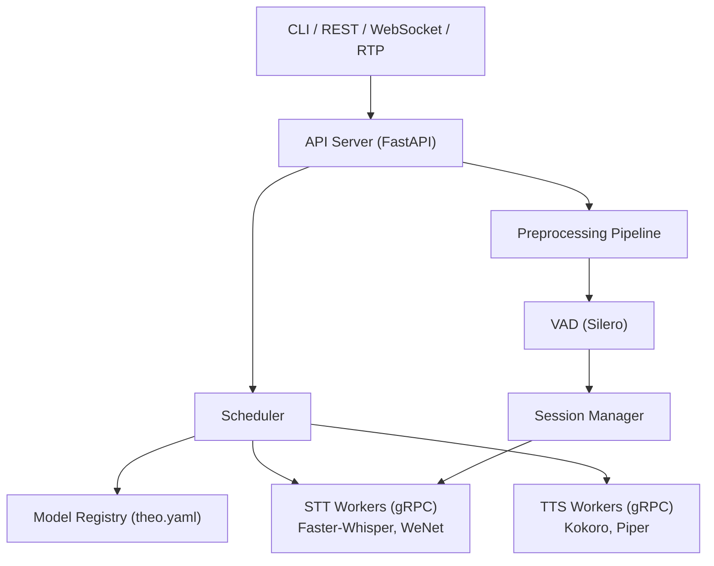

# Theo OpenVoice

Runtime unificado de voz (STT + TTS) com API compativel com OpenAI, construido do zero com bibliotecas maduras de inferencia como componentes substituiveis.

## Status

**M2 (gRPC Worker + Faster-Whisper) completo.** Worker STT como subprocess gRPC, FasterWhisperBackend, WorkerManager com auto-restart, structured logging, 127 testes unitarios.

O PRD completo (v2.1) esta disponivel em [`docs/PRD.md`](docs/PRD.md).

## API OpenAI-Compatible

| Endpoint | Metodo | Status | Descricao |
|---|---|---|---|
| `/v1/audio/transcriptions` | POST | Fase 1 | Transcricao de arquivo (batch) |
| `/v1/audio/translations` | POST | Fase 1 | Traducao para ingles (batch) |
| `/v1/audio/speech` | POST | Fase 1 | Sintese de voz (TTS) |
| `/v1/realtime` | WebSocket | Fase 2 | Streaming STT bidirecional |
| `/health` | GET | Fase 1 | Health check |
| `/metrics` | GET | Fase 1 | Metricas Prometheus |

Formatos de resposta suportados: `json`, `verbose_json`, `text`, `srt`, `vtt`.

## Quick Start

```bash
# Setup (cria venv + instala dependencias)
./setup.sh

# Instalar todos os extras
./dev.sh install all

# Baixar modelo STT
theo pull faster-whisper:large-v3

# Iniciar runtime
theo serve

# Transcrever arquivo
curl -X POST http://localhost:8000/v1/audio/transcriptions \
  -F file=@audio.wav \
  -F model=faster-whisper-large-v3

# Ou via CLI
theo transcribe audio.wav --model faster-whisper-large-v3
```

> **Nota:** Quick start funcional a partir da conclusao da Fase 1.
> Atualmente, M1 (fundacao) e M2 (gRPC worker + Faster-Whisper) estao completos.

## Instalacao

Requer Python 3.11+ e [uv](https://docs.astral.sh/uv/).

```bash
# Setup inicial (cria venv com Python 3.12 e instala dependencias dev)
./setup.sh

# Instalar todos os extras (server, gRPC, engines, dev)
./dev.sh install all

# Ou extras especificos
./dev.sh install dev,grpc
```

> **Importante:** O projeto usa `uv` para gerenciar o venv com Python 3.12.
> Nao use `pip install` diretamente — o Python do sistema pode ser incompativel.
> Use sempre `./dev.sh` ou prefixe com `.venv/bin/`.

## Desenvolvimento

O script `dev.sh` centraliza todos os comandos de desenvolvimento, garantindo que o Python correto do venv seja usado.

```bash
./dev.sh <comando> [args...]
```

| Comando | Descricao |
|---|---|
| `./dev.sh install [extras]` | Instala o projeto em modo editavel (`all`, `dev,grpc`, etc.) |
| `./dev.sh test` | Roda testes unitarios |
| `./dev.sh test tests/unit/test_types.py -v` | Roda teste especifico |
| `./dev.sh lint` | Ruff check + format check |
| `./dev.sh format` | Formata codigo com ruff |
| `./dev.sh typecheck` | Roda mypy |
| `./dev.sh check` | Lint + typecheck + testes (CI completo) |
| `./dev.sh proto` | Gera stubs protobuf |
| `./dev.sh pip list` | Qualquer comando pip (via uv) |
| `./dev.sh python -c '...'` | Executa Python do venv |
| `./dev.sh shell` | Abre bash com venv ativado |
| `./dev.sh info` | Mostra informacoes do ambiente |

**Exemplo: ciclo tipico de desenvolvimento:**

```bash
./dev.sh format             # formata
./dev.sh test               # roda testes
./dev.sh check              # CI completo (lint + typecheck + testes)
```

## Visao

Um unico binario que orquestra engines de inferencia (Faster-Whisper, Silero VAD, Kokoro, Piper) com:

- **Session Manager** com estados explicitos e recovery
- **Model Registry** com manifesto declarativo (inspirado no Ollama)
- **Audio Preprocessing/Post-Processing Pipelines**
- **CLI unificado**: `theo pull`, `theo serve`, `theo transcribe`
- **Streaming real** via WebSocket com partial/final transcripts
- **Ingestao RTP** para telefonia

## Arquitetura



Detalhes completos em [`docs/ARCHITECTURE.md`](docs/ARCHITECTURE.md).

## Roadmap

- **M1** — Fundacao (completo)
- **M2** — gRPC Worker + Faster-Whisper (completo)
- **Fase 1** — STT Batch + Preprocessing
- **Fase 2** — Streaming Real + Session Manager
- **Fase 3** — Telefonia + Scheduler Avancado

Detalhes completos no [PRD](docs/PRD.md).

## Inspiracoes

- **Ollama** — UX de CLI e modelo de registry local
- **Speaches** — Validacao de API compativel com OpenAI para STT
- **whisper-streaming** — Conceito de LocalAgreement para partial transcripts

## Licenca

[MIT](LICENSE)
